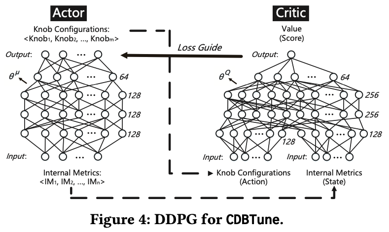
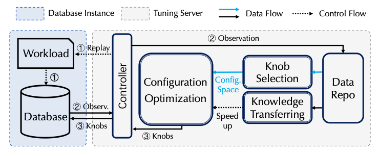

For decades, database performance tuning has been a "black art." A modern Database Management System (DBMS) can expose hundreds of configuration "knobs"—parameters that control everything from memory allocation for buffers and caches to I/O concurrency and logging behavior. The optimal settings for these knobs are not universal; they depend intricately on the specific hardware, the data distribution, and, most importantly, the dynamic workload the database is serving.

Finding the right combination of knob settings is an NP-hard problem. A seasoned Database Administrator (DBA) develops an intuition over years of experience, but even the most skilled expert struggles to navigate this vast, high-dimensional search space, especially in dynamic cloud environments where workloads can shift without warning.

Machine learning has emerged as a promising way to automate this process. While techniques like Bayesian Optimization (BO) have shown success, they often treat tuning as a static, black-box optimization problem. Andy Pavlo's research group (whose [DBMS lectures](https://www.youtube.com/@CMUDatabaseGroup) we all love!!) and startup (Ottertune) was trying to tackle the problem through this very method. Here is their paper from 2017: https://db.cs.cmu.edu/papers/2017/p1009-van-aken.pdf. However, there journey came to an [abrupt ending](https://x.com/andy_pavlo/status/1801687420330770841) couple of years later raising a [good sum of venture capital](https://www.intelcapital.com/ottertune-raises-12-million-series-a-funding-to-revolutionize-cloud-database-operations-led-by-intel-capital-and-race-capital/). We dont know what happened there. Ok enough gossip !! Coming back to the topic, Reinforcement Learning (RL), however, offers a different and powerful paradigm: it reframes tuning as a *sequential decision-making process*, where a software agent learns an optimal tuning *policy* through direct interaction with the database. This method was primarily developed at Guoliang Li's research group at Tsinghua University. Later comparative studies, framework and reproducible codebase came from Peking.

This post provides a mathematically rigorous, first-principles guide to understanding and applying deep reinforcement learning for DBMS configuration tuning. We will dissect how to frame this as an RL problem and delve into the mechanics of the Deep Deterministic Policy Gradient (DDPG) algorithm, a method uniquely suited for this challenge.

## Framing DBMS Tuning as a Reinforcement Learning Problem

The first step in applying RL is to formally define the problem within the mathematical framework of a **Markov Decision Process (MDP)**. An MDP is a model for sequential decision-making where the outcomes are partly random and partly under the control of a decision-maker, or "agent." In our case, the agent is our tuning system, and the "environment" is the DBMS itself.

An MDP is defined by a tuple $(S, A, P, R, \gamma)$. Let's break down each component in the context of database tuning, as exemplified by pioneering systems like CDBTune.

### State ($s_t \in S$)

The state is a snapshot of the environment that the agent observes at a given time $t$. For the agent to make an informed decision, the state must capture the operational status of the DBMS. A simple performance metric like throughput isn't enough; we need a richer representation.

The solution is to use the DBMS's own **internal metrics**. These are the hundreds of counters and gauges that the system maintains about its own performance, accessible through commands like `SHOW STATUS` in MySQL. These metrics include:

* **Counters for I/O operations**: `Innodb_pages_read`, `Innodb_pages_written`
* **Concurrency and locking statistics**: `Innodb_row_lock_waits`, `Innodb_row_lock_time`
* **Buffer pool usage**: `Innodb_buffer_pool_read_requests`, `Innodb_buffer_pool_wait_free`
* **Query execution statistics**: `Select_scan`, `Sort_rows`

A state vector $s_t$ is formed by collecting these metrics (e.g., 63 different metrics in CDBTune ) over a short interval. This vector provides a high-dimensional signature of the database's behavior under the current configuration and workload.

### Action ($a_t \in A$)

The action is what the agent *does* to influence the environment. In our case, an action corresponds to applying a new set of values to the DBMS's tunable knobs.

This is where the problem becomes challenging. The action space is both **high-dimensional** (we might be tuning dozens or hundreds of knobs simultaneously) and **continuous** (knobs like `innodb_buffer_pool_size` can take any value within a range). This immediately disqualifies simpler RL algorithms like tabular Q-learning or standard Deep Q-Networks (DQN), which are designed for discrete, low-dimensional action spaces.

### Reward ($r_t \in R$)

The reward is a scalar feedback signal that tells the agent how well it's doing. The agent's goal is to learn a policy that maximizes the cumulative reward over time. The reward function must be carefully designed to align with the DBA's ultimate goal: improving performance.

A robust reward function, as proposed in CDBTune, considers both the immediate change in performance and the overall improvement relative to the initial state. Let $T_t$ and $L_t$ be the throughput and latency at time $t$, and let $T_0$ and $L_0$ be the initial performance metrics. We can define the performance change from the initial state ($\Delta_{t \rightarrow 0}$) and the previous state ($\Delta_{t \rightarrow t-1}$) for throughput as:

$$ \Delta T_{t \to 0} = \frac{T_t - T_0}{T_0} \quad and \quad \Delta T_{t \to t-1} = \frac{T_t - T_{t-1}}{T_{t-1}} $$

just testing : 

$$ \lim_{n \to \infty} \sum_{k=1}^n \frac{1}{k^2} = \frac{\pi^2}{6-t+p} $$

Similar expressions can be defined for latency. The reward function can then be designed to give a positive signal when the performance improves relative to the baseline ($T_t > T_0$) and also incorporates the incremental improvement from the last step. A simplified form of the reward logic is:

$$
r_t \propto
\begin{cases}
f(\Delta_{t \rightarrow 0}, \Delta_{t \rightarrow t-1}) & \text{if } \Delta_{t \rightarrow 0} > 0 \\
-g(\Delta_{t \rightarrow 0}, \Delta_{t \rightarrow t-1}) & \text{if } \Delta_{t \rightarrow 0} \leq 0
\end{cases}
$$

where $f$ and $g$ are functions that combine the deltas. This structure encourages the agent to find configurations that are not just marginally better than the last, but fundamentally better than the starting point.

### Policy ($\pi(a_t|s_t)$)

The policy is the agent's brain. It's the strategy the agent uses to select actions based on the current state. In deep RL, the policy is represented by a deep neural network that takes the state vector $s_t$ as input and outputs an action vector $a_t$ (the knob settings). The goal of the entire learning process is to find the optimal policy, $\pi^*$, which maximizes the expected cumulative reward.

## Deep Deterministic Policy Gradient (DDPG)

To handle the high-dimensional, continuous action space of DBMS tuning, we need a sophisticated algorithm. DDPG is an excellent choice because it combines ideas from DQN with an **Actor-Critic** architecture designed specifically for continuous control.

DDPG maintains two main neural networks (and two corresponding "target" networks for stability):

1.  **The Actor Network ($\mu(s|\theta^\mu)$)**: This network represents the policy. It takes the state $s$ as input and outputs a single, *deterministic* action $a$ (a vector of specific knob values). It is the "actor" because it decides what to do.
2.  **The Critic Network ($Q(s, a|\theta^Q)$)**: This network learns the action-value function (the Q-value). It takes both a state $s$ and an action $a$ as input and outputs a single scalar value that estimates the expected cumulative future reward of taking action $a$ in state $s$. It is the "critic" because it evaluates the actions taken by the actor.

### The Learning Loop

The Actor and Critic learn in a symbiotic loop, using data sampled from an **Experience Replay Memory**. This memory stores past transitions $(s_t, a_t, r_t, s_{t+1})$ so that the networks can be trained on a diverse batch of uncorrelated experiences, which is crucial for stable learning.

Here's how they are trained at each step, using a mini-batch of $N$ transitions from the replay memory:

**1. Training the Critic:** The Critic is trained to approximate the Bellman equation, much like in DQN. We first compute a target Q-value, $y_i$, for each sample in the mini-batch. This target is formed by taking the immediate reward $r_i$ and adding the discounted Q-value of the *next* action, as predicted by the *target* networks (denoted with a prime, $Q'$ and $\mu'$):

$$y_i = r_i + \gamma Q'(s_{i+1}, \mu'(s_{i+1}|\theta^{\mu'})|\theta^{Q'})$$

The Critic network is then updated by minimizing the mean squared error between its current prediction $Q(s_i, a_i|\theta^Q)$ and this target value $y_i$:

$$L(\theta^Q) = \frac{1}{N}\sum_{i=1}^{N} (y_i - Q(s_i, a_i|\theta^Q))^2$$

**2. Training the Actor:** The Actor is trained to produce actions that maximize the Critic's predicted Q-value. In other words, the Actor wants to take actions that the Critic thinks are good. This is achieved by updating the Actor's parameters using the policy gradient. The gradient is calculated by backpropagating the gradient from the Critic's output with respect to the action, through the Actor network:

$$\nabla_{\theta^\mu} J \approx \frac{1}{N} \sum_{i=1}^{N} \nabla_a Q(s, a|\theta^Q)|_{s=s_i, a=\mu(s_i)} \nabla_{\theta^\mu} \mu(s|\theta^\mu)|_{s_i}$$

This update nudges the Actor's weights in the direction that will produce actions with higher Q-values for the given states.

**3. Exploration**: Since the actor's policy is deterministic, we must add noise to its actions during training to ensure adequate exploration of the state-action space. This is often done by adding a temporally correlated noise process (like an Ornstein-Uhlenbeck process) or simply Gaussian noise to the action vector before it is applied to the environment.

## End-to-End Workflow

An RL-based tuning system like CDBTune typically operates in two phases:

1.  **Offline Training**: First, a general-purpose tuning model is trained offline. This requires generating a diverse set of experiences. Standard database benchmarks like TPC-C and Sysbench are used to create various workloads, and the agent interacts with the DBMS under these workloads to populate its experience replay memory and learn a foundational tuning policy. This is a one-time, computationally intensive process that can take several hours.
2.  **Online Tuning**: When a user requests a tuning session for their specific production workload, the system doesn't start from scratch. It loads the pre-trained model and **fine-tunes** it on the user's live or replayed workload. This allows the agent to adapt its general knowledge to the specific characteristics of the new workload. This online phase is short, typically involving a small number of tuning steps (e.g., 5-10 iterations) to quickly converge on a high-performance configuration.

A lot of the reproducible code and a full fledged framework combining Knob Selection, Config Optimisation and Knowledge Transfer comes from this github repository from the DB group at Peking : https://github.com/PKU-DAIR/DBTune  

## Challenges and Frontiers

While powerful, the deep RL approach is not a silver bullet. Rigorous research demands we acknowledge its limitations, many of which are active areas of research.

* **Safety and the "Trial-and-Error" Problem**: The core learning mechanism of RL is exploration. An agent *must* try suboptimal or even bad actions to learn what not to do. In a simulated environment, this is acceptable. On a live production database, recommending a configuration that degrades performance by 50% or, worse, crashes the system, is catastrophic. This "unsafe exploration" is the single biggest challenge for deploying pure RL tuners online. 
* **Adaptability to Dynamic Workloads**: A standard DDPG agent learns a policy that maps a state to an action. It implicitly assumes the underlying dynamics (i.e., the workload) are stationary during tuning. If the workload changes dramatically *during* the online tuning process, the policy may become stale and ineffective.
* **Sample Efficiency**: Although DDPG is relatively sample-efficient for a deep RL algorithm, the fine-tuning process still requires multiple interactions with the database, each of which involves replaying a workload for several minutes. This can make the "online" tuning process longer than some users might tolerate.
* **Interpretability**: The final policy is a deep neural network—a black box. It can recommend a highly effective configuration, but it cannot explain *why* that configuration is effective. This lack of interpretability can be a significant barrier for DBAs who need to trust and understand the changes being made to their systems.

Bohan Zhang (cofounder at Ottertune) has an [awesome talk](https://www.youtube.com/watch?v=suG2tMeDxZE) from the HTAP Summit 2023 about some aspects of the problem which make it extremely hard to solve. Lack of repeatable workloads, no fixed baseline, lack of high fidelity training environments and what not. There are a lot of challenges and this remains an interesting (and hard) problem to look at. 

These challenges are driving the next wave of research, exploring hybrid models that combine the end-to-end learning of RL with the safety guarantees of constrained optimization methods or the adaptability of contextual models.

## References

### Using RL for Database Autotuning : 

1. https://dbgroup.cs.tsinghua.edu.cn/ligl/papers/sigmod19-cdbtune.pdf : An End-to-End Automatic Cloud Database Tuning System Using Deep Reinforcement Learning
2.  https://arxiv.org/pdf/2110.12654 : Facilitating Database Tuning with Hyper-Parameter Optimization: A Comprehensive Experimental Evaluation 
3. https://arxiv.org/pdf/2203.14473 : Towards Dynamic and Safe Configuration Tuning for Cloud Databases 
4. https://github.com/PKU-DAIR/DBTune 

### AI Driven Databases : 

5. https://aws.amazon.com/blogs/machine-learning/tuning-your-dbms-automatically-with-machine-learning/ 
6. Dan Van Aken's (one of the co-founders of Ottertune) Phd Thesis : https://www.danavanaken.com/files/vanaken21-thesis.pdf 
7. Bohan Zhang's Research Works : https://bohanzhang.me/#research 